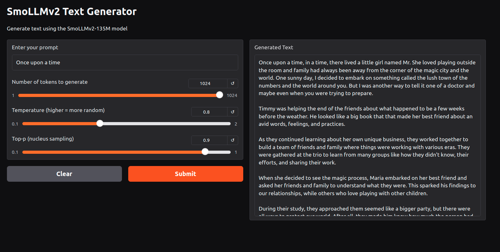

# Text Generation

- In this project, I've trained a text generation model using the SmollmV2-135M architecture.
- Here are some details about the model:
    - [model](https://huggingface.co/HuggingFaceTB/SmolLM2-135M) config is available on HuggingFace.
    - I've printed the model summary in the [notebook](S13.ipynb) and tried to recreate the model architecture.
- The model is trained on the [Cosmopedia-v2](https://huggingface.co/HuggingFaceTB/smollm-corpus) dataset.
- Streaming mode is used for the dataset so that the model can be trained on a large dataset without downloading the entire dataset.
- The model is using tokenizer from [Cosmo2-Tokenizer](https://huggingface.co/HuggingFaceTB/cosmo2-tokenizer)
- The model is trained for 5000 steps and the checkpoint is saved in the `last.ckpt` file.
- Later, the model is further trained for 50 steps and the checkpoint is used for inference.

- Model architecture for SmoLLMv2
```bash
LlamaForCausalLM(
  (model): LlamaModel(
    (embed_tokens): Embedding(49152, 576)
    (layers): ModuleList(
      (0-29): 30 x LlamaDecoderLayer(
        (self_attn): LlamaSdpaAttention(
          (q_proj): Linear(in_features=576, out_features=576, bias=False)
          (k_proj): Linear(in_features=576, out_features=192, bias=False)
          (v_proj): Linear(in_features=576, out_features=192, bias=False)
          (o_proj): Linear(in_features=576, out_features=576, bias=False)
          (rotary_emb): LlamaRotaryEmbedding()
        )
        (mlp): LlamaMLP(
          (gate_proj): Linear(in_features=576, out_features=1536, bias=False)
          (up_proj): Linear(in_features=576, out_features=1536, bias=False)
          (down_proj): Linear(in_features=1536, out_features=576, bias=False)
          (act_fn): SiLU()
        )
        (input_layernorm): LlamaRMSNorm((576,), eps=1e-05)
        (post_attention_layernorm): LlamaRMSNorm((576,), eps=1e-05)
      )
    )
    (norm): LlamaRMSNorm((576,), eps=1e-05)
    (rotary_emb): LlamaRotaryEmbedding()
  )
  (lm_head): Linear(in_features=576, out_features=49152, bias=False)
)
Total model parameters: 134,515,008
```

- Model recreated by modifying the Decoder only transformer architecture.
```bash
SmollmV2(
  (transformer): ModuleDict(
    (wte): Embedding(49152, 576)
    (h): ModuleList(
      (0-29): 30 x Block(
        (ln_1): LayerNorm((576,), eps=1e-05, elementwise_affine=True)
        (attn): CausalSelfAttention(
          (q_proj): Linear(in_features=576, out_features=576, bias=False)
          (k_proj): Linear(in_features=576, out_features=189, bias=False)
          (v_proj): Linear(in_features=576, out_features=189, bias=False)
          (o_proj): Linear(in_features=576, out_features=576, bias=False)
        )
        (ln_2): LayerNorm((576,), eps=1e-05, elementwise_affine=True)
        (mlp): MLP(
          (gate_proj): Linear(in_features=576, out_features=1536, bias=False)
          (up_proj): Linear(in_features=576, out_features=1536, bias=False)
          (down_proj): Linear(in_features=1536, out_features=576, bias=False)
        )
      )
    )
    (ln_f): LayerNorm((576,), eps=1e-05, elementwise_affine=True)
  )
  (lm_head): Linear(in_features=576, out_features=49152, bias=False)
)
Total model parameters: 134,411,328
```

- The configuration parameters of the project are in [config.py](config.py) file.
- Similar to the decoder only transformer architecture, weight sharing is used for embedding and unembedding layers.
- Residual standard scaling is used during the weight initialization of the model.
- `torch.cuda.synchronize()` is used to synchronize the CUDA operations for each batch.


---


## Modifications

I started with the vanilla decoder only transformer architecture and later modified it to match the SmollmV2 architecture. Following are the modifications done:
- Removed position embeddings in favor of RoPE (Rotary Position Embeddings)
- Split the attention into separate Q,K,V projections with reduced dimensions for K,V
- Kept the MLP structure with gate/up/down projections
- These changes align your model architecture more closely with modern transformer designs like Llama, while maintaining efficiency through reduced KV dimensions
- SiLU activation function is used instead of gelu
- Following configuration is used for the model:
  ```bash
  block_size: int = 2048    # max sequence length 
  vocab_size: int = 49152   # vocabulary size
  n_layer: int = 30         # number of transformer layers
  n_head: int = 9           # number of attention heads
  n_embd: int = 576         # embedding dimension
  mlp_ratio: int = 2.67     # Based on MLP implementation (1536/576)
  ```


---


## SpeedUp

Following are the modifications done to speed up the model training:

- Used `torch.set_float32_matmul_precision('high')`. Running float32 matrix multiplications in lower precision may significantly increase performance, and in some programs the loss of precision has a negligible impact.
- Used mixed precision for training (16-bit floating point) which reduces memory usage and speeds up training while maintaining accuracy. This is enabled through PyTorch's Automatic Mixed Precision (AMP) which automatically chooses when to use FP16 vs FP32.
- Compiled the model using `torch.compile()` which applies optimizations like kernel fusion and memory planning to speed up model execution. This can provide speedup on modern GPUs.
- Used `Flash Attention` for attention mechanism which reduces memory usage from O(n^2) to O(n) and improves speed by avoiding redundant memory accesses. This is especially important for long sequences.
- Used vocab size as a multiple of 2^16 (49152 = 3 * 2^14) which allows for better memory alignment and more efficient computation on GPUs. This can improve throughput by reducing wasted computation cycles.


---


## Sample Output

```bash
Prompt: Once upon a time
Generated: Once upon a time, in a time, there lived a little girl named Mr. She loved playing outside the room and family had always been away from the corner of the magic city and the world. One sunny day, I decided to embark on something called the lush town of the numbers and the world around you. But I was another way to tell it one of a doctor and maybe even when you were trying to prepare.

Timmy was helping the end of the friends about what happened to be a few weeks before
--------------------------------------------------

Prompt: The future of artificial intelligence
Generated: The future of artificial intelligence in the late 19th century. She was a beautiful book with a piece of words, albeit as a group of the late 200th century. She was an elderly man named Sarah who were gone to her summer, where she came to turn it with her mind. But this left was to learn about what they were.

One day, while discussing the complexity of their work, he moved around her newfound passion for the community. Her conversation held a stronger and sustainable recognition
--------------------------------------------------

Prompt: In the distant galaxy
Generated: In the distant galaxy of the bustling city of a lively little kid, there was a curious person named Alex. He was called "The Green-the Guide to the time of the late 1900s, while others worked together. He loved playing happily and any consequences of sustainability - to make more about the world around the world.

One day, while She had always looked at a girl, fascinated by the community, she decided to bake up the street. It had been around for friends and family
--------------------------------------------------
```


## Try it out

Application Link: https://huggingface.co/spaces/Shilpaj/SmoLLMv2

